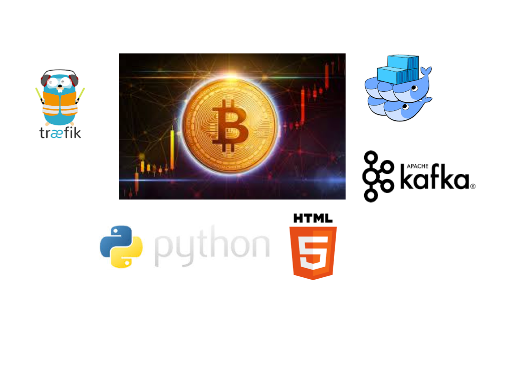
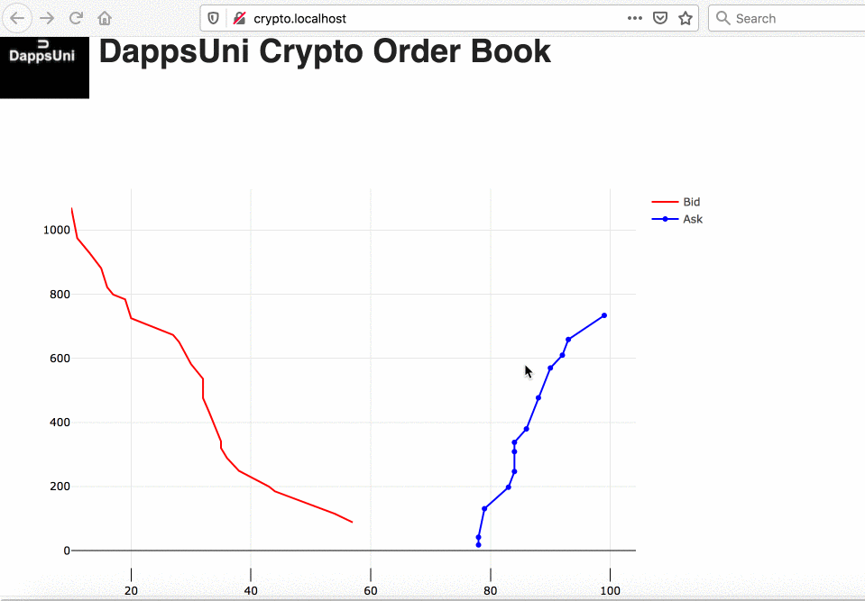

# Crypto Trading Workshop
 
 

### Intro : What we're building
* https://www.gate.io/en/trade/BTC_USDT

### Repo
* https://github.com/dappsunilabs/crypto-workshop-short


### OR download zip and unzip
https://github.com/dappsunilabs/crypto-workshop-short/archive/master.zip

### Tech Stack
* Docker Swarm (instead of Kubernetes)
    >>> ease of use

* Kafka: https://kafka.apache.org/
    >>> scalable, persistent storage

* Traefik: https://github.com/traefik/traefik
    >>> automated loadbalancing , reverse proxy, SSL

* Python: API/ Limit Order Engine
    >>> Easy to code/ manage, fast

* HTML/ Asynch JS: UI
    >>> Easy to code, visualize

### Example implementation
* https://crypto.dappsuni.com/

* https://kafdrop.dappsuni.com/

* https://traefik.dappsuni.com/dashboard/#/

## STEP 1: Download all images
## Pull required docker images
```sh
docker pull eshnil2000/crypto-trading
docker pull confluentinc/cp-zookeeper:latest
docker pull confluentinc/cp-kafka:latest
docker pull obsidiandynamics/kafdrop
docker pull traefik:v2.3
docker pull eshnil2000/generator
docker pull eshnil2000/detector
```
## STEP 2: clone the repo
```sh
git clone https://github.com/dappsunilabs/crypto-workshop
```
#OR download zip and unzip
https://github.com/dappsunilabs/crypto-workshop/archive/master.zip

## STEP 3: (MAC ONLY)
* Setup /etc/hosts to route to localhost subdomains (Firefox, Safari browsers)
    >>> Note the "\t" is a tab
```sh
sudo echo -e "127.0.0.01\tcrypto.localhost" >>/etc/hosts
sudo echo -e "127.0.0.01\twhoami.localhost" >>/etc/hosts
sudo echo -e "127.0.0.01\tkafdrop.localhost" >>/etc/hosts
```
## If this doesn't work, manually edit /etc/hosts and add following lines:
```sh
sudo nano /etc/hosts

## Traefik
127.0.0.01      whoami.localhost
127.0.0.01      kafdrop.localhost
127.0.0.01      crypto.localhost
```
## STEP 4: 
* Base Docker setup
```sh
docker swarm init
docker network create -d overlay --attachable traefik_default
```
## STEP 5: 
* Setup Traefik
```sh
docker stack deploy -c docker-compose.traefik-base.yml traefik
```
## STEP 6: 
* check stack 
```sh
docker stack ls
```
## STEP 7: 
* check traefik dashboard: Browser

    >>> http://localhost:8080

    >>> http://whoami.localhost
    
    >>> http://crypto.localhost    

    >>> http://kafdrop.localhost
## STEP 8: 
* Setup Kafka
```sh
docker stack deploy -c docker-compose.traefik.kafka.yml kafka

### check stack 
```sh
docker stack ls
```
### check kafka dashboard: Browser
http://kafdrop.localhost

* ##########SKIP THESE STEPS #################
*     >>> Setup Crypto trading engine
```
docker build -t crypto-trading .
docker stack deploy -c docker-compose.yml crypto
docker stack rm crypto

#Setup the transaction generator/detector
docker build -t detector .
docker build -t generator .
```
* ###########END SKIP STEPS################

## STEP 9: 
```sh
docker stack deploy -c docker-compose.kafka.detgen.yml detgen
```
### check kafka dashboard: Browser
* http://kafdrop.localhost

### Stop the transaction generator, so you can use the UI to generate transactions
```sh
docker service ls
docker service rm detgen_generator
```
## STEP 10: 
* Setup Crypto trading engine with basic auth
```sh
docker stack rm crypto

docker stack deploy -c docker-compose.basic-auth.yml crypto
docker stack deploy -c docker-compose.kafka.detgen.yml detgen

```
## STEP 11: 
* Check you can login at http://crypto.localhost with "dappsuni", "dappsuni"
```sh
docker stack rm crypto
```
## STEP 12: 
* Setup Crypto trading engine with parametrized environment variables support
```sh
env $(cat .env | grep ^[A-Z] | xargs) docker stack deploy -c docker-compose.basic-auth.env.yml crypto

docker stack rm crypto
```
